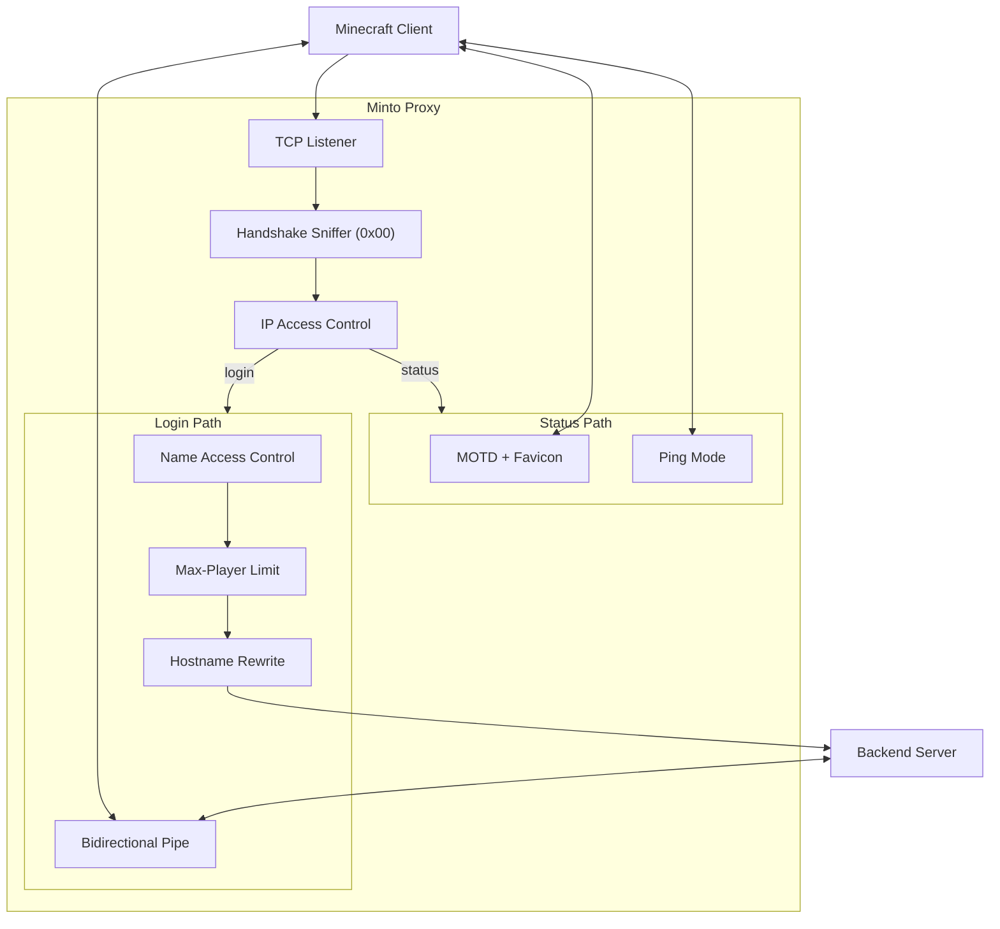

# Minto

**Minto** is a lightweight Minecraft proxy built with pure Python. It requires zero third-party dependencies while remaining fully asynchronous, configurable, and easy to extend.

It sits between Minecraft clients and a backend server, transparently inspects the Minecraft handshake, rewrites the target hostname/port, applies access controls, and serves a fully customizable server-list MOTD.

---

## Screenshots


## Why Minto?

- **Zero dependencies** — runs on the Python standard library alone (`asyncio`, `struct`, `zlib`, …). Nothing to `pip install`.
- **Readable & hackable** — clean, well-documented modules for the Minecraft protocol, proxying, and logging.
- **Self-contained MOTD** — generates a valid favicon PNG in code, no image libraries needed.
- **Config-driven** — define one or many proxy services in a single JSON file.

## Features

Networking

- Async TCP proxy
- Handshake sniffing
- Hostname rewriting

Server List (MOTD)

- Custom MOTD
- Custom favicon

Security

- IP allow/deny
- Player allow/deny

Misc

- Logging
- Multi-service

## Requirements

- Python **3.10+**
- No external packages

## Quick Start

```bash
git clone https://github.com/zhaozhuoran/minto
cd minto

# First run generates config/config.json and exits with instructions
python main.py

# Edit config/config.json, then run again
python main.py
```

Stop the proxy with `Ctrl+C`.

## Architecture



## Configuration

Configuration lives in `config/config.json` (auto-generated on first run). A service looks like:

```jsonc
{
  "Name": "Hypixel-in",
  "Listen": 25565,
  "TargetAddress": "mc.hypixel.net",
  "TargetPort": 25565,
  "IPAccess": { "Mode": "", "List": [] },
  "Minecraft": {
    "EnableHostnameRewrite": true,
    "RewrittenHostname": "mc.hypixel.net",
    "OnlineCount": { "Max": 2026, "Online": -1, "EnableMaxLimit": false },
    "NameAccess": { "Mode": "", "List": [] },
    "PingMode": "disconnect",
    "MotdFavicon": "{DEFAULT_MOTD}",
    "MotdDescription": "§d{NAME}§e, provided by Minto §a§o\n§c§lProxy for §6§n{HOST}:{PORT}§r",
  },
}
```

- `IPAccess` / `NameAccess` `Mode`: `""` (disabled), `"accept"` (allow-list), or `"deny"` (block-list).
- `MotdFavicon`: `"{DEFAULT_MOTD}"` for the built-in icon, or any `data:image/png;base64,...` string.
- `OnlineCount.Online`: `-1` reports the live connection count.

## Project Layout

```
main.py              Entry point: banner, config load, services, signal handling
minto/
  config.py          ConfigManager + default config template
  logger.py          Colored logger with daily zip archiving
  proxy.py           Proxy instance + bidirectional tunnel
  protocol/
    varint.py        VarInt encode/decode
    packet.py        Handshake / Login Start packets
    favicon.py       Pure-stdlib PNG favicon generator
tests/test_minto.py  unittest suite
```

## Tests

```bash
python -m unittest discover -s tests
```

## Roadmap

- Config hot-reload & modular routing engine
- Linux socket performance optimizations

## 🌟 Project Origin

This project was developed as part of HackClub Stardance.

View the original project page: [https://stardance.hackclub.com/projects/33308](https://stardance.hackclub.com/projects/33308)

## License

Minto is released under the **GNU Affero General Public License v3.0 (AGPL-3.0)**.

See [LICENSE](LICENSE) for details.
